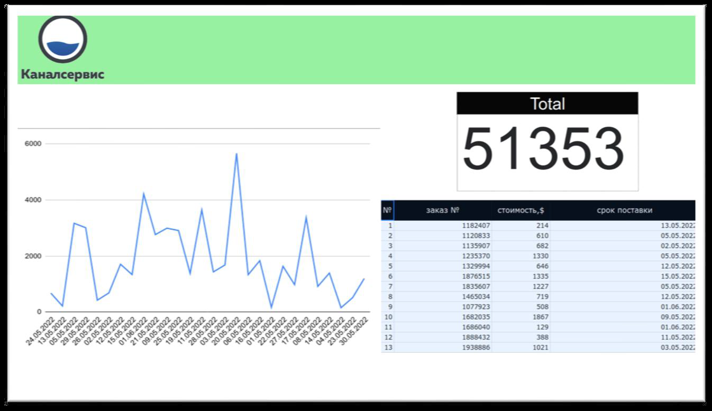
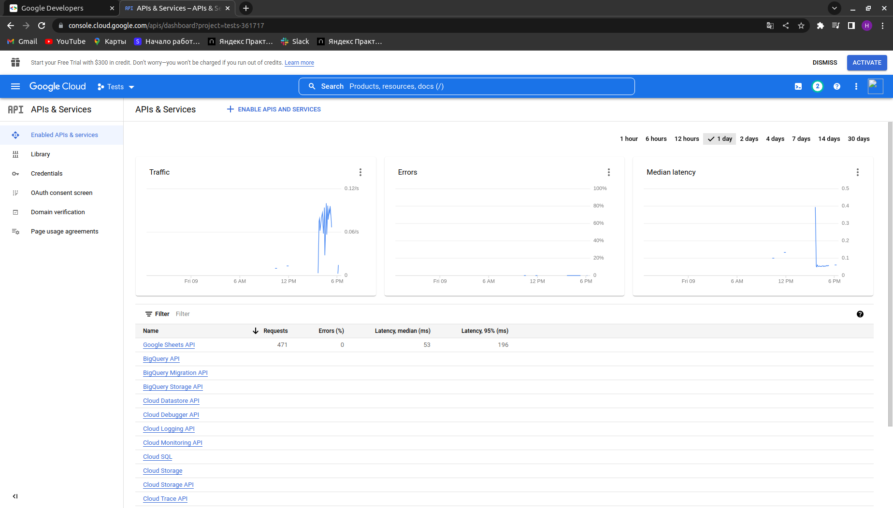
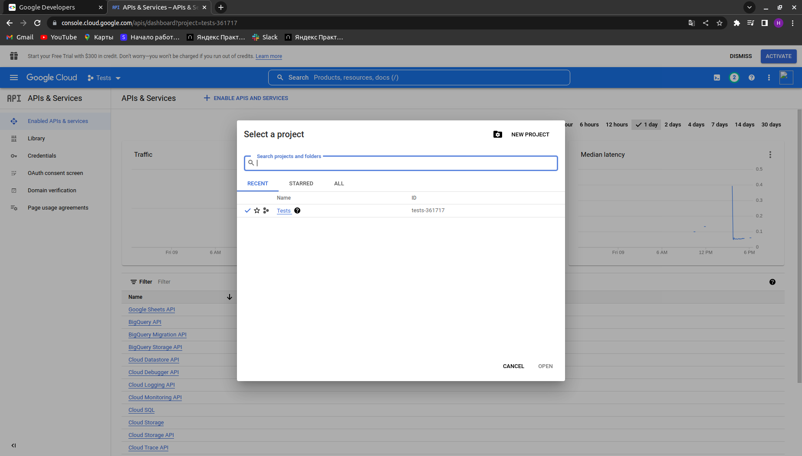
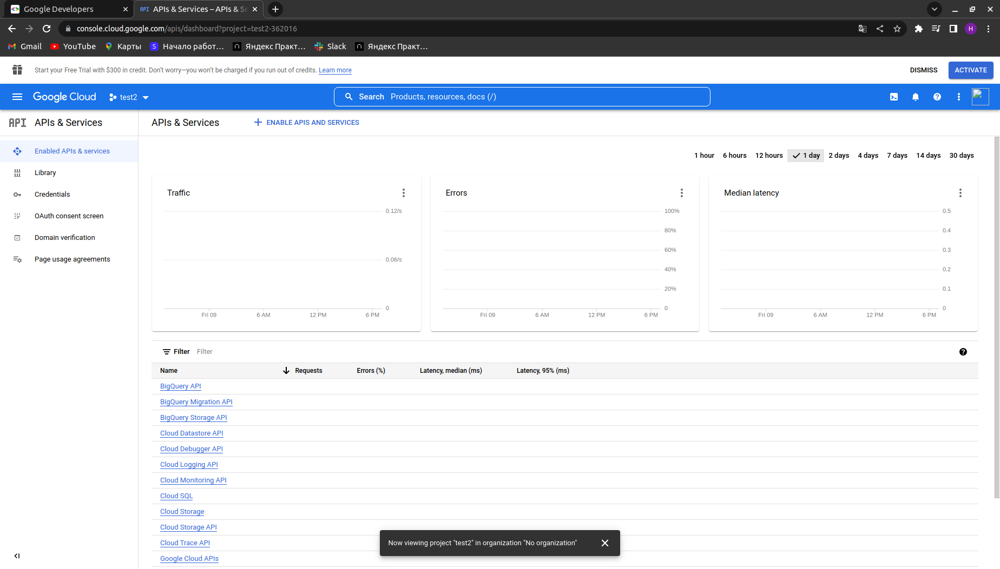
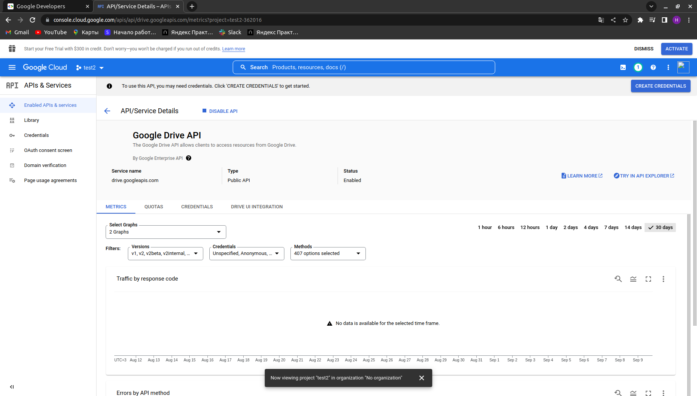
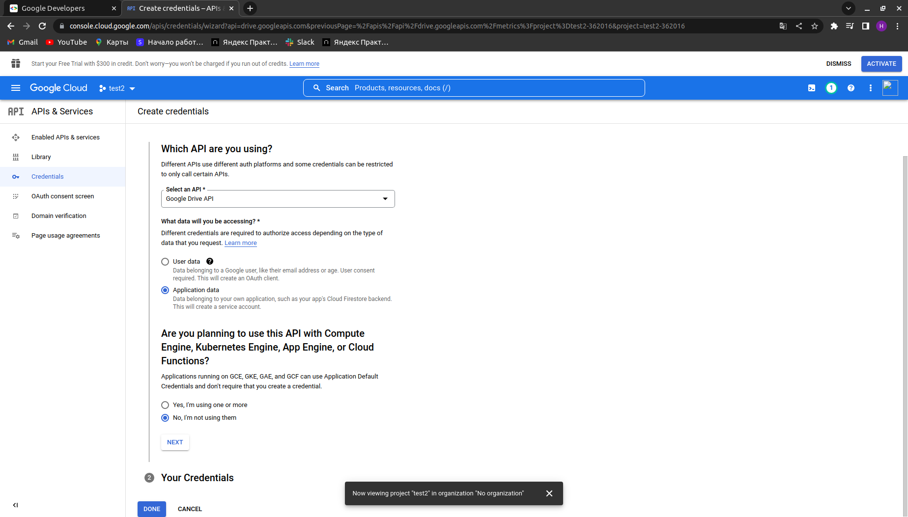
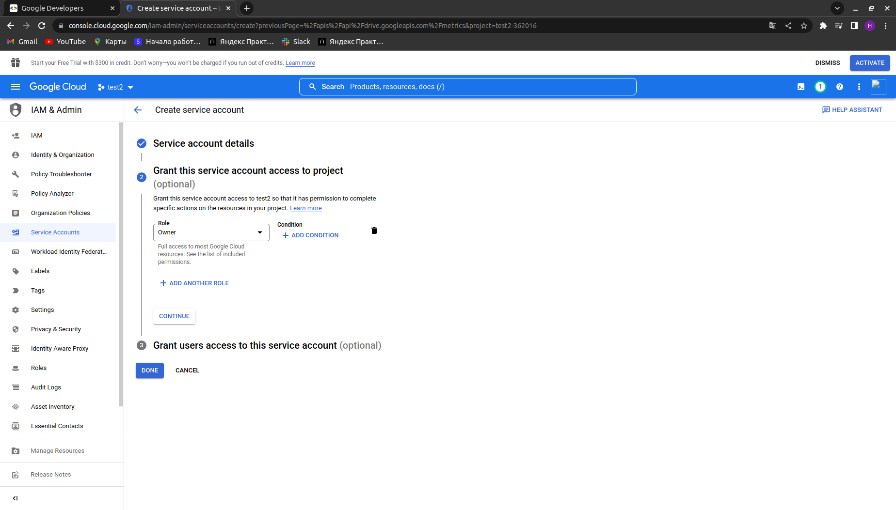
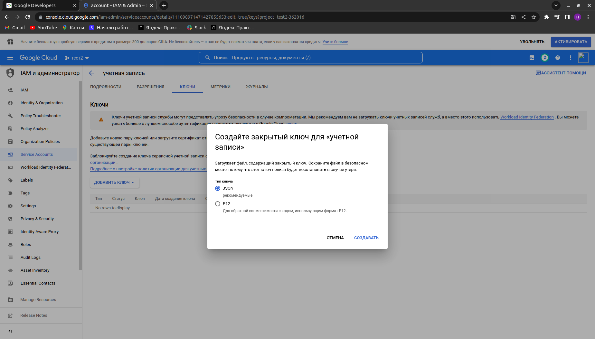
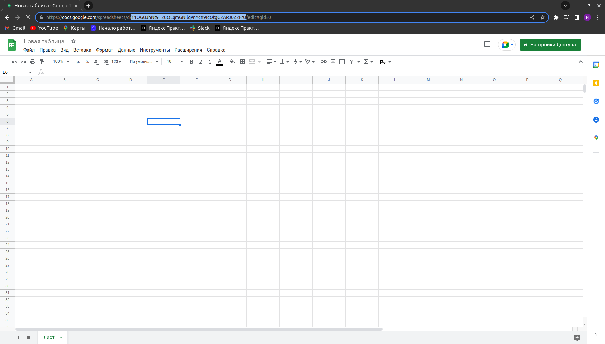
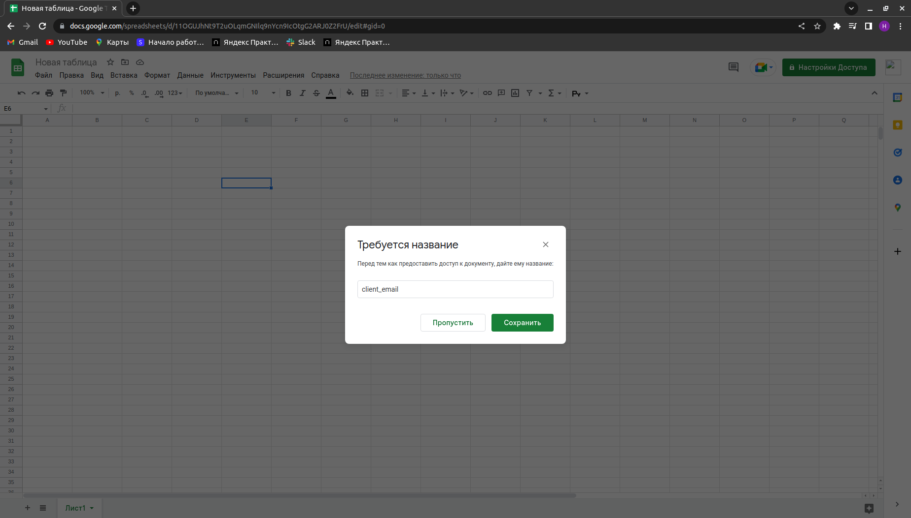

# Задание 

Необходимо разработать скрипт на языке Python 3, 

который будет выполнять следующие функции:

1. Получать данные с документа при помощи Google API, сделанного в [Google Sheets](https://docs.google.com/spreadsheets/d/1f-qZEX1k_3nj5cahOzntYAnvO4ignbyesVO7yuBdv_g/edit) (необходимо копировать в свой Google аккаунт и выдать самому себе права).
2. Данные должны добавляться в БД, в том же виде, что и в файле –источнике, с добавлением колонки «стоимость в руб.»
    
    a. Необходимо создать DB самостоятельно, СУБД на основе PostgreSQL.
    
    b. Данные для перевода $ в рубли необходимо получать по курсу [ЦБ РФ](https://www.cbr.ru/development/SXML/).
    
3. Скрипт работает постоянно для обеспечения обновления данных в онлайн режиме (необходимо учитывать, что строки в Google Sheets таблицу могут удаляться, добавляться и изменяться).

Дополнения, которые дадут дополнительные баллы и поднимут потенциальный уровень оплаты труда:

1. a. Упаковка решения в docker контейнер
    
    b. Разработка функционала проверки соблюдения «срока поставки» из таблицы. В случае, если срок прошел, скрипт отправляет уведомление в Telegram.
    
    c. Разработка одностраничного web-приложения на основе Django или Flask. Front-end React.
    
    
    

1. Решение на проверку передается в виде ссылки на проект на Github.
В описании необходимо указать ссылку на ваш Google Sheets документ (открыть права чтения и записи для пользователя (Мистер Х), а также инструкцию по запуску разработанных скриптов.

# Инструкция по запуску (коротко):
    1. Необходимо создать сервисный аккаунт -> появится файл creds.json

    2. Создать GoogleSheets документ -> узнаем id документа по url

    3. Добавить в настройках доступа GoogleSheets документа:
        этот сервисный акк ->  строка в файле creds.json  -> client_email
    4. Подключаем телеграм бота

# Инструкция по запуску:
    1. Нужно создать приложение:
        Заходим https://console.cloud.google.com/apis/

        
        Нажимаем на кнопку проект -> new project и Заполняем форму
      

        Нужно установаить 2 API: кнопка Enable apis ans services 
        1. Подключаем google drive api
        2. Подключаем google sheets api  
  

        Добавляем учетные Данные: кнопка CREATE CREDENTIALS
  
        
        Заполняем форму
    

        Заполняем Service account details
   

        Создаем закрытый ключ (json)
   

        Будет скачен файл name.json (переименовать в creads.json)
        

    2. Заходим https://docs.google.com/spreadsheets/u/0/ -> пустой файл
 

    Нашли по url id документа

    3. Добавить в настройках доступа GoogleSheets документа:
        этот сервисный акк ->  строка в файле creds.json  -> client_email
 

    4. Подключаем телеграм бота (смотри telegram/README.md)

    5. Заполняем файл с настройками: (файд creds я оставлю)
        CREDENTIALS_FILE = "creds.json"
        spreadsheet_id = "192ee2Nt8VsnThS79iUp5H8d-w9NmaJndfUms-FQ6-Gg"
        TOKEN = "СВОЙ ТОКЕН"
        GROUP_ID = 0000

# Запуск
    1. docker-compose build
    2. docker-compose up 

# Пояснение к структуре

    GoogleAPI
    ├── creds.json                          # Данные для авторизации для GoogleSheets
    ├── dataclass                           # Основные обьекты
    │   └── order.py                        # Класс Order
    ├── db.py                               # Инициализация БД
    ├── main.py                             # Основной файл запуска
    ├── models                              # Модели
    │   ├── __init__.py                     # Описание всех моделей (OrderModels)
    │   └── order.py                        # Функции с таблицей OrderModels
    ├── reqierements.txt                    # Зависимости проекта 
    ├── server                              # API  
    │   ├── __init__.py
    │   ├── schemas.py                      # Схемы  
    │   └── server.py                       # Основной файл запуска сервера на Flask
    ├── settings.py                         # Основной файл с настройками
    ├── sheet                               # Модуль работы с GoogleSheet
    │   ├── dollar_rate.py                  # Курс ЦБ РФ
    │   └── google_sheet.py                 # Проверяем обновления
    └── telegram                            # Модуль рыботы с телеграм
        ├── bot.py                          # бот телеграм
        └── README.md  

